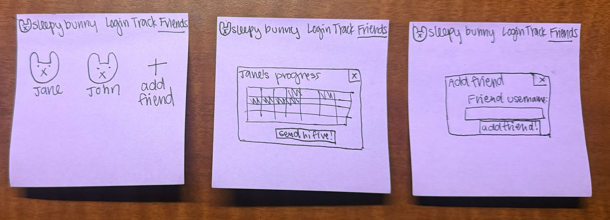

# Sleepy Bunny 🐰

[My Notes](notes.md)

## 🚀 Specification Deliverable

Sleepy Bunny is an adorable sleep log app where you improve the mood and energy of your virtual pet rabbit by achieving your sleep goals. 

For this deliverable I did the following. I checked the box `[x]` and added a description for things I completed.

- [x] Proper use of Markdown
- [x] A concise and compelling elevator pitch
- [x] Description of key features
- [x] Description of how you will use each technology
- [x] One or more rough sketches of your application. Images must be embedded in this file using Markdown image references.

### Elevator pitch

If there's one thing teenagers and young adults frequently complain about, it's how exhausted they are. However, they usually don't take time to fix their sleep schedules. Sleepy Bunny instantly brings awareness to how much sleep you're getting. Not only can you set a sleep goal, log your hours, and share your progress with friends, but your bunny mirrors the effects of your sleep duration; if you slept four hours last night, you can bet your bunny will be nearly falling asleep. This fluffy friend is exactly what you need to get your sleep schedule back on track.

### Design

The app will consist of three main parts: the login, track, and friends pages. The login page is where a user can create an account or log in to an existing account so that their data is saved. The tracking page is the main page of the application, which includes the user's bunny, who will be animated based on mood, and two popup windows: goal and progress. The goal popup will allow the user to see and edit their ideal sleep window and how many hours of sleep they want to get per night. The progress window will show a calendar with the days that the user hit their sleep goal shaded in. On the friends page, the user can see the progress of the friends they've added and send praise, and they can also add new friends with the friend's username.

### Key features

- An adorable pet rabbit who greets you immediately after you sign in. This virtual pet reflects your mood based on your sleep schedule; he'll be exhausted if you didn't sleep well and energetic if you hit your goals.
- Progress monitoring. It's easy to see how consistent you've been at a glance through the shaded calendar feature.
- Friends! Staying on track is always easier with friends, and Sleepy Bunny makes it easy for you to check in on your friends and send them encouraging messages.

### Technologies

I am going to use the required technologies in the following ways.

- **HTML** - Login and register controls, tracking page, goals and progress pop-ups and controls, friends page, friends' progress details, adding a friend controls.
- **CSS** - Pastel color scheme, highlighting when hovering over buttons, shading / animation with popups and friend celebrations.
- **React** - Routing between tabs and popups, updating bunny status and progress calendar based on sleep data logged.
- **Service** - Store user progress and goals, login and logout details. Third party call to generate the weather of the week. 
- **DB/Login** - Stores user progress and goals.
- **WebSocket** - Share user's streak on a leaderboard. 

## 🚀 AWS deliverable

For this deliverable I did the following. I checked the box `[x]` and added a description for things I completed.

- [X] **Server deployed and accessible with custom domain name** - [My server link](https://startup.sleepybunny.click/).

## 🚀 HTML deliverable

For this deliverable I did the following. I checked the box `[x]` and added a description for things I completed.

- [x] I completed the prerequisites for this deliverable (Simon deployed, GitHub link, Git commits)
- [x] **HTML pages** - I created HTML pages for all of the different tabs of my app: Login (index), weather, track, goal, leaderboard, and progress. 
- [x] **Proper HTML element usage** - I used BODY, NAV, MAIN, HEADER, and FOOTER tags, as well as tables, div, paragraph, a tags, and span. 
- [x] **Links** - All pages contain a nav bar with links to the login, track, weather, and leaderboard pages. Track page has additional links to the progress and goal pages which have links that go back to the track page. 
- [x] **Text** - I added text on each page, including headers, what the bunny will say based on how well you sleep, progress chart placeholder, weather chart placeholder, headers and descriptors. 
- [x] **3rd party API placeholder** - This appears on my weather page where the app will call to a weather API.
- [x] **Images** - I included a logo image in the browser tab, as well as a placeholder image for the bunny mascot on the track page and the weather banner on the weather page. 
- [x] **Login placeholder** - I have a login screen with a username and password field, and the program greets the user by username on the track page. 
- [x] **DB data placeholder** - I have a page for both the user's progress/streak, as well as a page for the user's goal. 
- [x] **WebSocket placeholder** - There is a leaderboard tab that will show which users have the highest streak.

## 🚀 CSS deliverable

For this deliverable I did the following. I checked the box `[x]` and added a description for things I completed.

- [x] **Visually appealing colors and layout. No overflowing elements.** - All of my elements fit within the page. I have a visually appealing color pallette with shades of purple and a mint green accent.
- [x] **Use of a CSS framework** - I used Bootstrap for button and field elements.
- [x] **All visual elements styled using CSS** - Everything on my page is styled with CSS, including my bunny avatars. All fonts, sizes, and colors are styled with CSS.
- [x] **Responsive to window resizing using flexbox and/or grid display** - I used both flexbox and grid display. Grid display for my streak calendar and weather, and flexbox for just about every other element.
- [x] **Use of a imported font** - I used "Copperplate", "Copperplate Gothic Light", serif for my logo font in the top left corner. All other text is "Inter", sans-serif.
- [x] **Use of different types of selectors including element, class, ID, and pseudo selectors** - I used many different types of selectors. I set overall rules for my elements and then used class and ID tags to specify things. I also used pseudo selectors to enable hover features. 

## 🚀 React part 1: Routing deliverable

For this deliverable I did the following. I checked the box `[x]` and added a description for things I completed.

- [ ] **Bundled using Vite** - I did not complete this part of the deliverable.
- [ ] **Components** - I did not complete this part of the deliverable.
- [ ] **Router** - I did not complete this part of the deliverable.

## 🚀 React part 2: Reactivity deliverable

For this deliverable I did the following. I checked the box `[x]` and added a description for things I completed.

- [ ] **All functionality implemented or mocked out** - I did not complete this part of the deliverable.
- [ ] **Hooks** - I did not complete this part of the deliverable.

## 🚀 Service deliverable

For this deliverable I did the following. I checked the box `[x]` and added a description for things I completed.

- [ ] **Node.js/Express HTTP service** - I did not complete this part of the deliverable.
- [ ] **Static middleware for frontend** - I did not complete this part of the deliverable.
- [ ] **Calls to third party endpoints** - I did not complete this part of the deliverable.
- [ ] **Backend service endpoints** - I did not complete this part of the deliverable.
- [ ] **Frontend calls service endpoints** - I did not complete this part of the deliverable.
- [ ] **Supports registration, login, logout, and restricted endpoint** - I did not complete this part of the deliverable.

## 🚀 DB deliverable

For this deliverable I did the following. I checked the box `[x]` and added a description for things I completed.

- [ ] **Stores data in MongoDB** - I did not complete this part of the deliverable.
- [ ] **Stores credentials in MongoDB** - I did not complete this part of the deliverable.

## 🚀 WebSocket deliverable

For this deliverable I did the following. I checked the box `[x]` and added a description for things I completed.

- [ ] **Backend listens for WebSocket connection** - I did not complete this part of the deliverable.
- [ ] **Frontend makes WebSocket connection** - I did not complete this part of the deliverable.
- [ ] **Data sent over WebSocket connection** - I did not complete this part of the deliverable.
- [ ] **WebSocket data displayed** - I did not complete this part of the deliverable.
- [ ] **Application is fully functional** - I did not complete this part of the deliverable.
