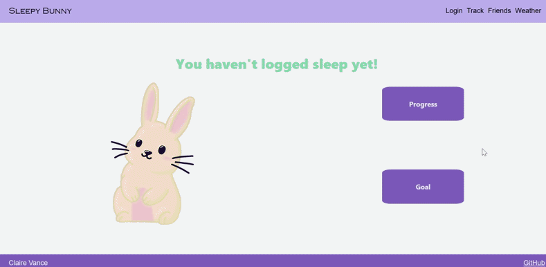
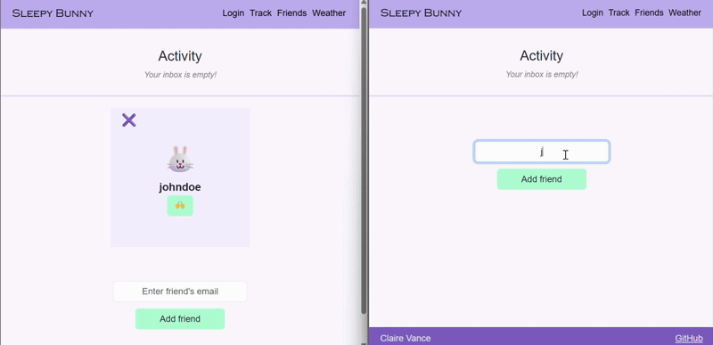

# Sleepy Bunny 🐰
> An adorable sleep log app where your sleep duration is reflected by the state of your bunny.

### Overview

With sleep deprivation being such an acute problem among teens and adults, **Sleepy Bunny** instantly brings awareness to nightly habits. The app allows users to **set a sleep goal, log hours, and share progress** with friends while their virtual pet mirrors their data. For example, if a user only logs four hours of sleep, their bunny will be nearly asleep. This fluffy friend is perfect to help users get their sleep schedule back on track.

### Key Features

- **Visual Reminders:** After signing in, the user is greeted by an adorable bunny who reflects the user's energy levels. He'll be exhausted if they didn't sleep well the previous night and energized if they hit their goals.
- **Goal Updates:** Hours of sleep needed vary from person to person, so each user can quickly update their sleep goal according to their needs.
- **Progress monitoring:** Featuring a calendar that displays the last 30 days, users can see at a glance how often they hit their sleep goals, with days they hit their goal shaded green and days they didn't shaded yellow. Days that haven't been logged yet are shaded gray and can be updated by clicking on them and typing in the number of hours slept.
- **Friends:** Users have the option to add friends via email and send them high fives.

- **Weather:** Users can see the current weekly forecast, which is updated regularly with API calls.

*This project was built for BYU's CS 260 (Web Development) course to demonstrate proficiency in full-stack architecture, database management, and real-time networking protocols.*

### Tech Stack

- **Frontend:** `React`, `HTML`, `CSS`
- **Backend:** `Node.js`, `Express`, `WebSocket`
- **Database & Security:** `MongoDB`, `BCrypt`, `HTTP-Only Cookies`
